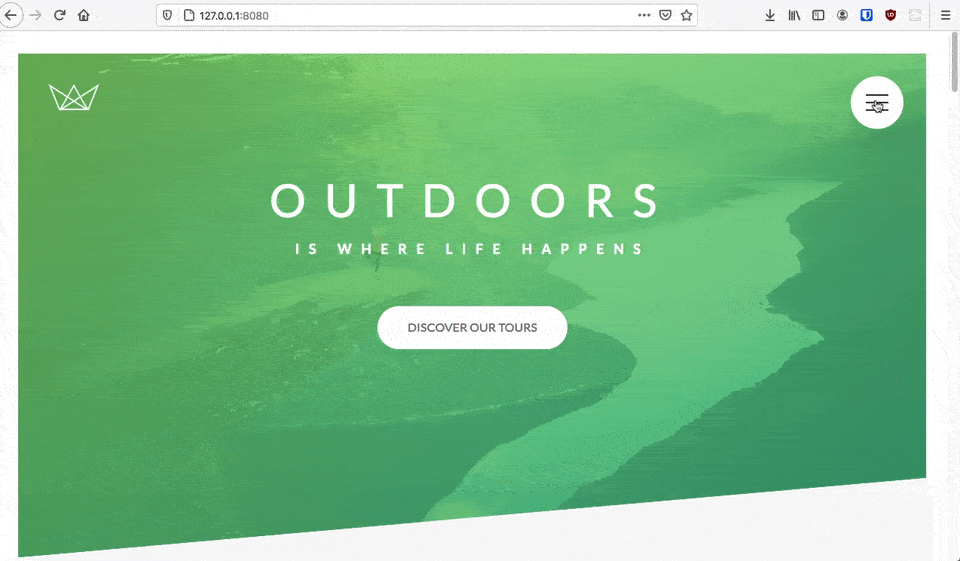

# Natours - Landing Page

This is a landing page for a fictitious company, built with [Sass](https://sass-lang.com/), following the [BEM methodology](https://en.bem.info/methodology/) and the 7-1 Sass Architecture pattern (see [leanhowtoprogram - 7-1 Sass Architecture](https://www.learnhowtoprogram.com/user-interfaces/building-layouts-preprocessors/7-1-sass-architecture)).



## Table of content

1. [Features](#features)
2. [Variables](#variables)
3. [Mixins](#mixins)
4. [Base](#base)
5. [Animations](#animations)
6. [Utilities](#utilities)
7. [Others](#others)

## <a name="features"></a>Features

- Fully responsive (desktop, tablet landscape, tablet portrait, mobile).
- Advanced CSS animations using `@keyframes`, `animation` and `transition`.
- CSS-only popup.
- CSS-only menu.
- Interactive form.

## <a name="variables"></a>Variables

Use Sass variables to set default colors, font sizes, grid system:

```scss
// COLORS
$color-primary: #7ed56f;
$color-primary-light: #55c57a;
$color-primary-dark: #28b485;

$color-secondary-light: #ffb900;
$color-secondary-dark: #ff7730;

$color-tertiary-light: #2998ff;
$color-tertiary-dark: #5643fa;

$color-grey-light-1: #f7f7f7;
$color-grey-light-2: #eee;

$color-dark-grey: #777;
$color-dark-grey-2: #999;
$color-dark-grey-3: #333;

$color-white: #fff;
$color-black: #000;
```

```scss
// GRID
$grid-width-desktop: 114rem;
$grid-width-tab-land: 95rem;
$grid-width-tab-port: 80rem;
$grid-width-mobile: 40rem;

$gutter-vertical: 8rem;
$gutter-vertical-medium: 6rem;
$gutter-vertical-small: 3rem;
$gutter-horizontal: 6rem;
```

```scss
// FONT SIZES
$default-font-size: 1.6rem;
```

## <a name="mixins"></a>Mixins

Clear floats with the **"clearfix"** hack ([W3schools - How To - Clear Floats](https://www.w3schools.com/howto/howto_css_clearfix.asp)):

```scss
@mixin clearfix {
  &::after {
    content: "";
    display: table;
    clear: both;
  }
}
```

Easily center a child element inside its parent without `flexbox` with the `transform` property:

```scss
@mixin center-inside-parent {
  position: absolute;
  top: 50%;
  left: 50%;
  transform: translate(-50%, -50%);
}
```

Create a **media query manager** using Sass `@content` and `@if` directives:

```scss
@mixin adapt($breakpoint) {
  @if $breakpoint == phone {
    @media only screen and (max-width: 37.5em) {
      @content;
    } // < 600px
  } @else if $breakpoint == tab-port {
    @media only screen and (max-width: 56.25em) {
      @content;
    } // < 900px
  } @else if $breakpoint == tab-land {
    @media only screen and (max-width: 75em) {
      @content;
    } // < 1200px
  } @else if $breakpoint == big-desktop {
    @media only screen and (min-width: 112.5em) {
      @content;
    } // > 1800px
  }
}
```

## <a name="base"></a>Base

Basic reset using the universal selector `*`:

```scss
*,
*::after,
*::before {
  margin: 0;
  padding: 0;
  box-sizing: inherit;
}
```

Modify the default value of `1rem` to make it equal to `10px` instead of `16px` (`10px = 62.5% x 16px`):

```scss
html {
  // This defines what a 1rem is: 10px instead of 16px.
  font-size: 62.5%;

  @include adapt(big-desktop) {
    font-size: 75%; // 1rem = 12px / 16px = 75%
  }

  @include adapt(tab-land) {
    font-size: 56.25%; // 1rem = 9px / 16px = 56.25%
  }

  @include adapt(tab-port) {
    font-size: 50%; // 1rem = 8px / 16px = 50%
  }
}
```

Customize the look of the portion of an element selected by the user by using the `::selection` selector:

```scss
::selection {
  background-color: $color-primary;
  color: $color-white;
}
```

## <a name="animations"></a>Animations

Use the `@keyframes` CSS at-rule to **create advanced animations** ([MDN - @keyframes](https://developer.mozilla.org/en-US/docs/Web/CSS/@keyframes), [MDN - Using CSS animations](https://developer.mozilla.org/en-US/docs/Web/CSS/CSS_Animations/Using_CSS_animations)).

```scss
@keyframes moveInLeft {
  0% {
    opacity: 0;
    transform: translateX(-10rem);
  }

  80% {
    transform: translateX(1rem);
  }

  100% {
    opacity: 1;
    transform: translateX(0);
  }
}
```

## <a name="utilities"></a>Utilities

Make margins consistent throughout the page by using "utility" classes:

```scss
.u-center-text {
  text-align: center !important;
}

.u-margin-bottom-small {
  margin-bottom: 1.6rem !important;
}
.u-margin-bottom-medium {
  margin-bottom: 4.8rem !important;
}
.u-margin-bottom-big {
  margin-bottom: 6.4rem !important;

  @include adapt(phone) {
    margin-bottom: 3.4rem !important;
  }
}

.u-margin-top-small {
  margin-top: 1.6rem !important;
}
.u-margin-top-medium {
  margin-top: 4.8rem !important;
}
.u-margin-top-big {
  margin-top: 6.4rem !important;
}
```

## <a name="others"></a>Others

Use `clip-path` property to **create a clipping region that sets what part of an element should be shown** ([MDN - clip-path](https://developer.mozilla.org/en-US/docs/Web/CSS/clip-path))

```scss
.section-features {
  clip-path: polygon(0 20%, 100% 0, 100% 80%, 0 100%);
}
```

Use `linear-gradient()` to create a **nice background image consisting of a progressive transition between two or more colors along a straight line** ([MDN - linear-gradient()](<https://developer.mozilla.org/en-US/docs/Web/CSS/linear-gradient()>))

```scss
.section-features {
  background-image: linear-gradient(
      to right bottom,
      rgb($color-primary, 0.8),
      rgb($color-primary-dark, 0.8)
    ), url(../img/nat-4.jpg);
}
```
